## Rotifer Species Summer Offshore-Nearshore Biomass Barplot

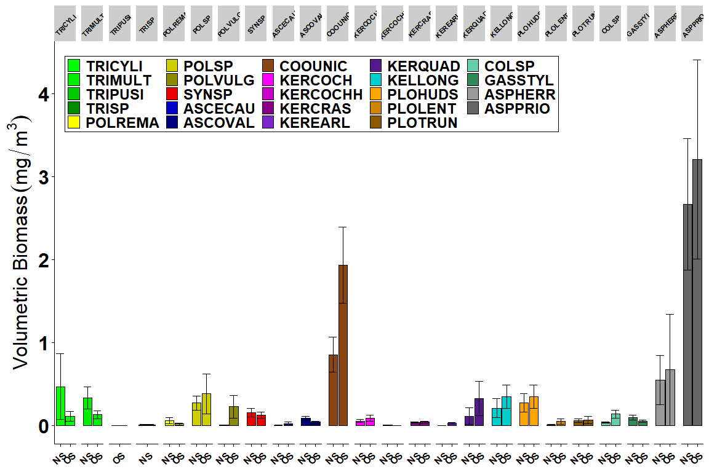

This figure X1 isn't a good candidate for the CSMI nearshore report as there are a lot of details here that aren't necessarily relevant. However, it is an interesting look at each of the 24 taxa encountered between the offshore and nearshore communities. The presence of the *Asplanchna* species makes the other taxa details difficult to view in this plot, therefore insights on the greater community are included in the subsequent figure which excludes *Asplanchna*. It is typical for *Asplanchna* to contribute greatly to the overall rotifer community biomass (Marshall et al., 2024), and that is exhibited in this plot. Both species have higher biomass in the offshore waters but these differences are not significant. However, there is a clear biomass difference between the more common *Asplanchna priodonta* compared to the rarer *Asplanchna herricki*.

[References:]{.underline}

Marshall, C.C., Watkins, J.M., Connolly, J.K., Boynton, P.V., Schaefer, S.L., Currie, W.J.S., Rudstam, L.G., 2024. Patterns and drivers of seasonal succession and vertical distribution in the rotifer community of Lake Ontario in 2018. J. Great Lakes Res. 50, 102283. <https://doi.org/10.1016/j.jglr.2024.102283>.

## Rotifer Species Spring Offshore-Nearshore Biomass Barplot

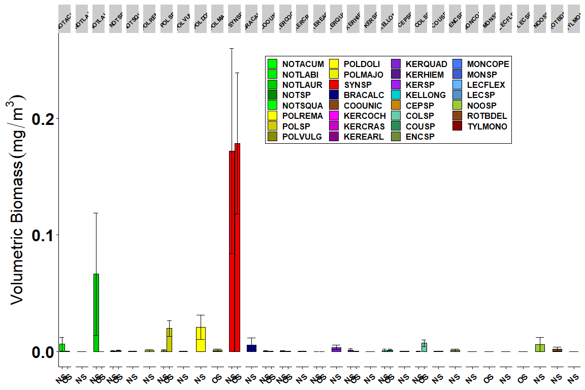

## Rotifer Species Summer Offshore-Nearshore Biomass Barplot Excluding Asplanchna

 Average Biomass-1.png)

This Figure X2 shows a closer look at each of the 22 taxa (excluding *Asplanchna*) encountered between the nearshore and offshore samples. *Trichocera pusilla* was the only taxa not found in both offshore and nearshore samples, having only been identified in the offshore, which highlights how rare it is to encounter. The three remaining *Trichocerca* species have a higher biomass in the nearshore vs. offshore, but not significantly different. This is likely related to the higher nutrient concentrations found in the nearshore waters supporting a higher density of these eutrophic-loving taxa (Gannon and Stemberger 1978; Sládecek, 1983). *Polyarthra remata* has a slightly higher nearshore biomass, and *Polyarthra vulgaris* has a significantly higher offshore biomass. It should be noted that *P. vulgaris* identifications are based on a feature (lateral fin) that is often difficult to view using our methods, and densities may be higher than is represented. *P. vulgaris* are considered a eurytopic taxa and are historically dominant in Lake Ontario, making them an important part of the rotifer community (Marshall et al., 2024). Most *Keratella* species showed higher biomass in the offshore but not a significant level of difference. *Keratella cochlearis* are considered a common eurytopic species which promotes their similar offshore-nearshore communities, while the larger more uncommon *Keratella quadrata* has a higher biomass in the offshore waters. *Ploesoma hudsoni*, the largest species in the genus, had slightly higher biomass in the offshore waters, while the smaller *Ploesoma lenticulare* and *Ploesoma truncatum* had significantly higher and nearly identical biomass values, respectively.

[References:]{.underline}

Gannon, J.E., Stemberger, R.S., 1978. Zooplankton (especially crustaceans and rotifers) as indicators of water quality. Trans. Am. Microsc. Soc. 97, 16–35.

Sládecek, V., 1983. Rotifers as indicators of water quality. Hydrobiologia 100, 169–171.

Marshall, C.C., Watkins, J.M., Connolly, J.K., Boynton, P.V., Schaefer, S.L., Currie, W.J.S., Rudstam, L.G., 2024. Patterns and drivers of seasonal succession and vertical distribution in the rotifer community of Lake Ontario in 2018. J. Great Lakes Res. 50, 102283. <https://doi.org/10.1016/j.jglr.2024.102283>.

## Spring Rotifer Species Offshore-Nearshore Biomass Barplot Excluding Synchaeta

 Average Biomass-1.png)

## Rotifer Genera Summer Offshore-Nearshore Biomass Barplot

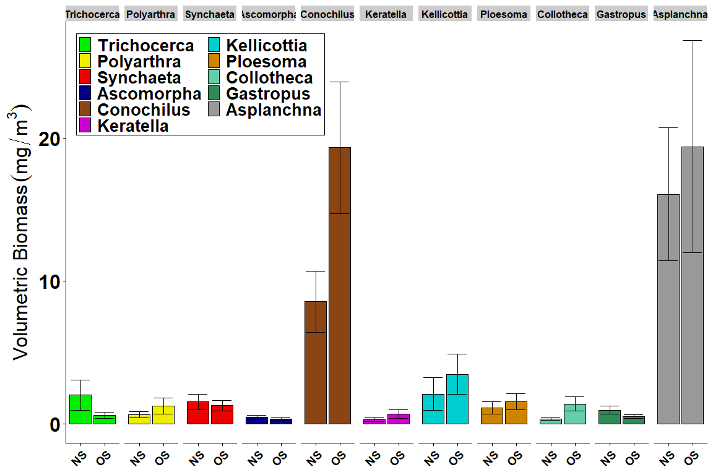

This Figure 1 shows a focused look at the 11 taxa encountered between the nearshore and offshore samples for Lake Ontario in August 2023. With several exceptions, most rotifer taxa exhibited higher average biomass values in the offshore samples, suggesting that these waters supported higher densities and perhaps larger taxa compared to shallower habitats. One exception to this were *Trichocerca*, which had a higher biomass in the nearshore vs. offshore, and can be attributed to the higher nutrient concentrations found in nearshore waters supporting a greater density of these eutrophic-loving taxa (Gannon and Stemberger 1978; Sládecek, 1983). *Gastropus* were the remaining taxa to show a slight preference for the nearshore waters. *Synchaeta* and *Ascomorpha* were taxa that exhibited very similar biomass values between near- and offshore waters. These insights suggest that despite higher food concentrations in nearshore habitats, only several taxa gain a clear advantage in these conditions.

Barbiero and Warren (2011) found that several taxa (*Collotheca*, *Gastropus*, *Conochilus*, *Kellicottia*) all increased in dominance at lower TP concentrations in the Laurentian Great Lakes. Both *Polyarthra* and *Keratella* biomass were higher in the offshore waters indicating more favorable conditions for these taxa despite lower nutrient levels. However, since the introduction of the predatory cladoceran *Cercopagis pengoi* into Lake Ontario in 1998 (MacIsaac et al., 1999), *Polyarthra* and *Keratella* populations have declined as a result of predation pressures (Barbiero and Warren 2011; Makarewicz and Lewis, 2015, Marshall et al., 2024), complicating our understanding of these vulnerable taxa. Three more taxa (*Kellicottia*, *Ploesoma*, and *Asplanchna*) maintained higher biomass in the offshore but were not significantly different from shallower waters, indicating only slightly favorable conditions offshore. The large raptorial *Asplanchna*, which predates on microzooplankton (including rotifers), algae, and ciliates, maintained high biomass contributions in both the nearshore and offshore samples suggesting ample and diverse food resources in both habitats.

Finally, the remaining two taxa, *Collotheca* and *Conochilus*, showed significantly higher biomass in the offshore. *Conochilus* is a soft-bodied rotifer capable of forming large colonies, an effective predation avoidance technique. Extended individuals can reach 450 μm in length (Stemberger, 1979) while colonies can approach 1 mm in size (Haney et al., 2014), leading to high variability in *Conochilus* abundance and biomass. Another introduced predatory cladoceran, *Bythotrephes longimanus*, has been linked to increases in rotifer densities (particularly *Conochilus* - Hovious et al., 2006; Pothoven and Vanderploeg, 2022) which are released from exploitative competition with herbivorous cladocerans, such as *Daphnia* a preferred prey for *Bythotrephes* (Schulz and Yurista, 1998).

[References:]{.underline}

Barbiero, R.P., Warren, G.J., 2011. Rotifer communities in the Laurentian Great Lakes, 1983–2006 and factors affecting their composition. J. Great Lakes Res. 37, 528–540. <https://doi.org/10.1016/j.jglr.2011.04.007>.

Gannon, J.E., Stemberger, R.S., 1978. Zooplankton (especially crustaceans and rotifers) as indicators of water quality. Trans. Am. Microsc. Soc. 97, 16–35.

Haney, J.F., et al., 2014. An-Image-based Key to the Zooplankton of North America. version 5.0 released 2013, University of New Hampshire Center for Freshwater Biology. <http://cfb.unh.edu/cfbkey/html/index.html>.

Hovious, J.T., Beisner, B.E., McCann, K.S., 2006. Epilimnetic rotifer community responses to *Bythotrphes longimanus* invasion in Canadian Shield lakes. Limnol. Oceanogr. 51, 1004–1012.

MacIsaac, J.H., Grigorovich, I.A., Hoyle, J.A., Yan, N.D., and Panov, V. 1999. Invasion of Lake Ontario by the Ponto-Caspian predatory cladoceran Cercopagis pengoi. Can. J. Fish. Aquat. Sci. 56:1–5.

Makarewicz, J.C., Lewis, T.W., 2015. Long-term changes in Lake Ontario rotifer abundance and composition: A response to Cercopagis predation? J. Great Lakes Res. 41, 192–199. <https://doi.org/10.1016/j.jglr.2014.11.018>.

Marshall, C.C., Watkins, J.M., Connolly, J.K., Boynton, P.V., Schaefer, S.L., Currie, W.J.S., Rudstam, L.G., 2024. Patterns and drivers of seasonal succession and vertical distribution in the rotifer community of Lake Ontario in 2018. J. Great Lakes Res. 50, 102283. <https://doi.org/10.1016/j.jglr.2024.102283>.

Pothoven, S.A., Vanderploeg, H.A., Factors affecting rotifer assemblages along a nearshore to offshore transect in southeastern Lake Michigan, J. Great Lakes Res. 48, 1230-1238. <https://doi.org/10.1016/j.jglr.2022.08.009>.

Sládecek, V., 1983. Rotifers as indicators of water quality. Hydrobiologia 100, 169–171.

Stemberger, R.S., 1979. A guide to the rotifers of the Laurentian Great Lakes. Report No. EPA-600/4-79-021. U.S. EPA Environmental Monitoring and Support Laboratory, Cincinnati, 1–200 pp.

## Rotifer Genera Summer Offshore-Nearshore Density Barplot

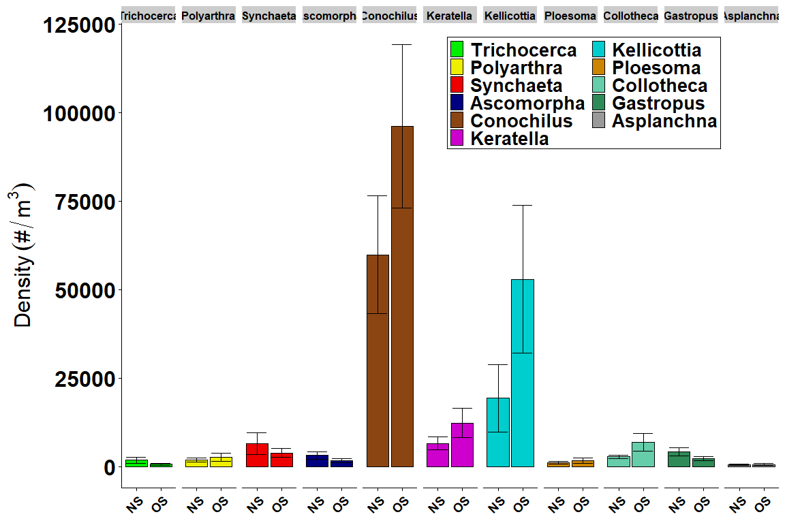

## Rotifer Genera Spring Offshore-Nearshore Biomass Barplot

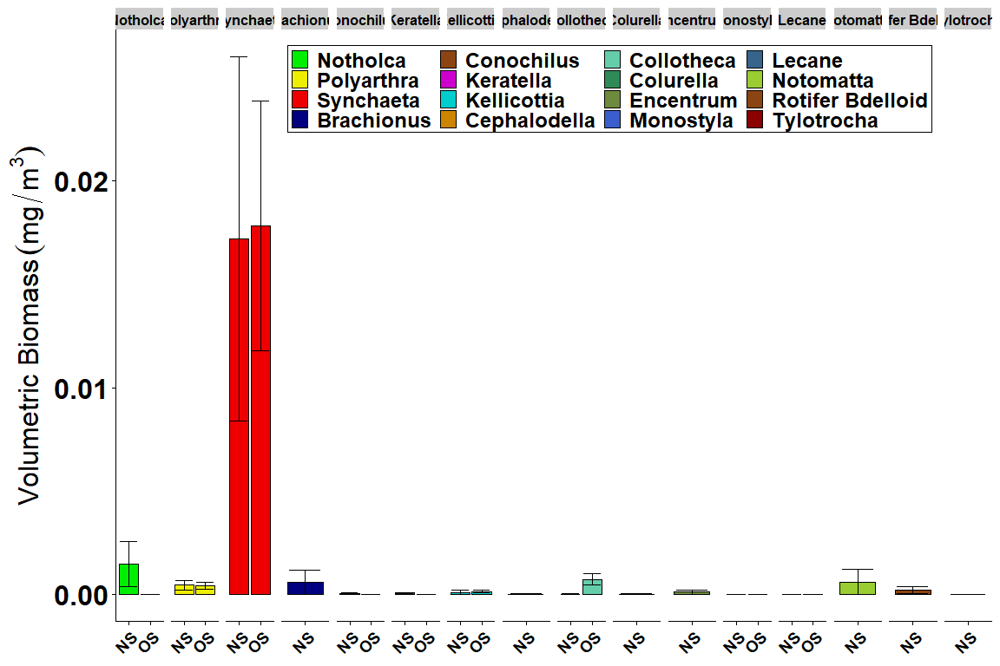

## Rotifer Genera Spring Offshore-Nearshore Density Barplot

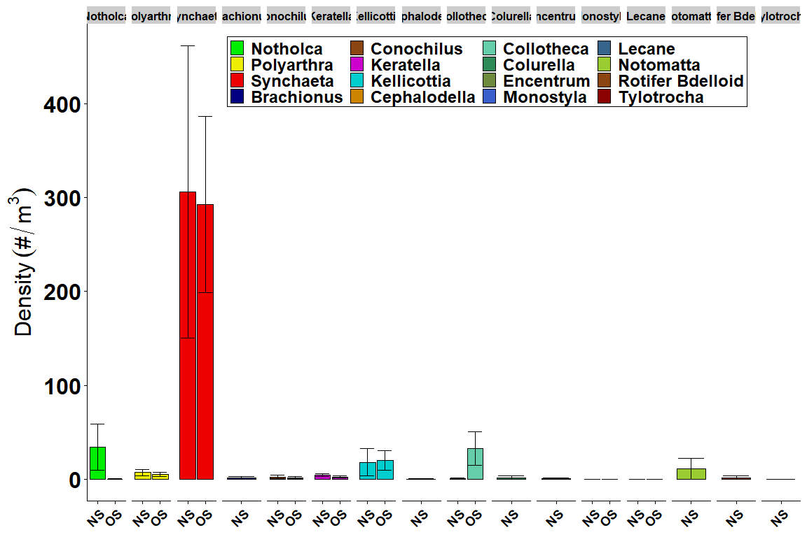

## Rotifer Genera Summer Offshore-Nearshore Biomass Boxplot

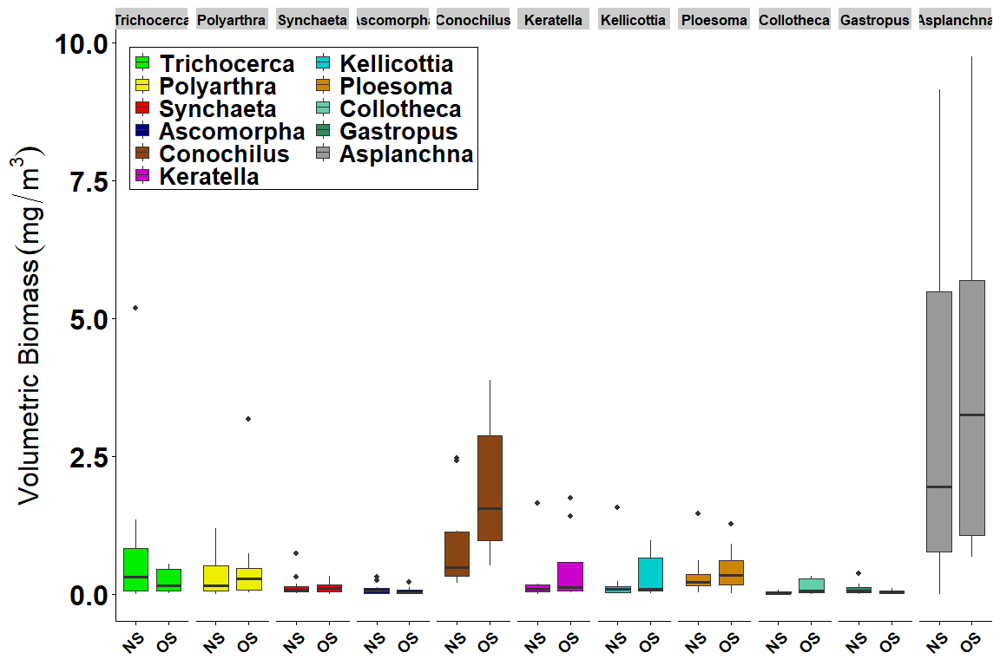

|contrast |Rot_GENERA  |   estimate|       SE|       df|    t.ratio|   p.value|
|:--------|:-----------|----------:|--------:|--------:|----------:|---------:|
|NS - OS  |Ascomorpha  |  16.701923| 22.90431| 138.6968|  0.7292044| 0.4671062|
|NS - OS  |Asplanchna  | -17.692308| 22.90431| 138.6968| -0.7724445| 0.4411655|
|NS - OS  |Collotheca  | -48.432692| 22.90431| 138.6968| -2.1145668| 0.0362557|
|NS - OS  |Conochilus  | -26.403846| 22.90431| 138.6968| -1.1527895| 0.2509797|
|NS - OS  |Gastropus   |  20.375000| 22.90431| 138.6968|  0.8895706| 0.3752368|
|NS - OS  |Kellicottia | -25.528846| 22.90431| 138.6968| -1.1145870| 0.2669551|
|NS - OS  |Keratella   | -27.182692| 22.90431| 138.6968| -1.1867938| 0.2373378|
|NS - OS  |Ploesoma    |  -9.269231| 22.90431| 138.6968| -0.4046938| 0.6863261|
|NS - OS  |Polyarthra  | -12.673077| 22.90431| 138.6968| -0.5533054| 0.5809451|
|NS - OS  |Synchaeta   |   1.480769| 22.90431| 138.6968|  0.0646502| 0.9485456|
|NS - OS  |Trichocerca |  18.778846| 22.90431| 138.6968|  0.8198827| 0.4136897|

## Rotifer Genera Spring Offshore-Nearshore Biomass Boxplot

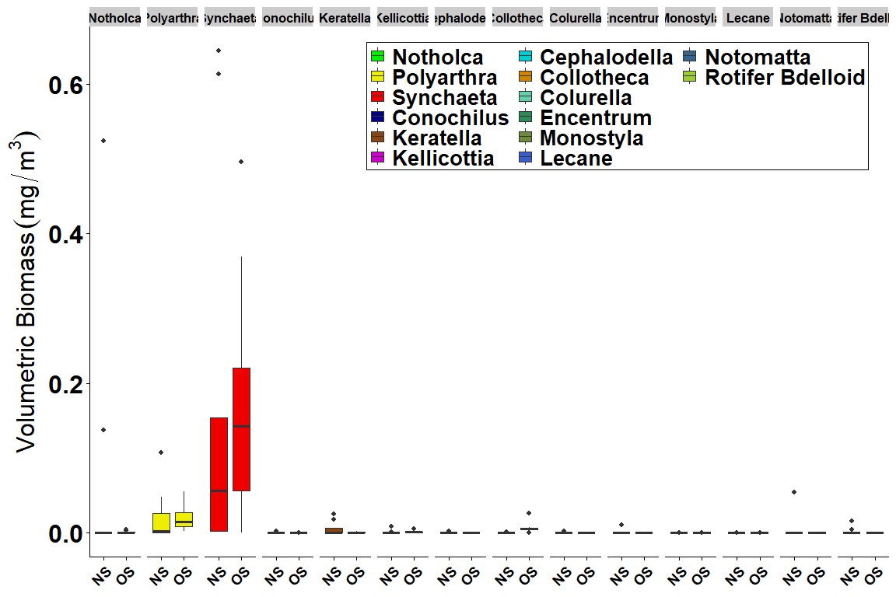

|contrast |Rot_GENERA       |    estimate|       SE|       df|    t.ratio|   p.value|
|:--------|:----------------|-----------:|--------:|--------:|----------:|---------:|
|NS - OS  |Cephalodella     |   34.555556| 21.03861| 193.8932|  1.6424830| 0.1021107|
|NS - OS  |Collotheca       | -102.194444| 21.03861| 193.8932| -4.8574718| 0.0000024|
|NS - OS  |Colurella        |   40.333333| 21.03861| 193.8932|  1.9171104| 0.0566940|
|NS - OS  |Conochilus       |   35.097222| 21.03861| 193.8932|  1.6682293| 0.0968843|
|NS - OS  |Encentrum        |   35.222222| 21.03861| 193.8932|  1.6741708| 0.0957093|
|NS - OS  |Kellicottia      |  -48.993056| 21.03861| 193.8932| -2.3287214| 0.0209044|
|NS - OS  |Keratella        |   14.826389| 21.03861| 193.8932|  0.7047229| 0.4818283|
|NS - OS  |Lecane           |  -13.041667| 21.03861| 193.8932| -0.6198921| 0.5360566|
|NS - OS  |Monostyla        |   13.326389| 21.03861| 193.8932|  0.6334254| 0.5272023|
|NS - OS  |Notholca         |   38.506944| 21.03861| 193.8932|  1.8302991| 0.0687405|
|NS - OS  |Notomatta        |   54.388889| 21.03861| 193.8932|  2.5851943| 0.0104663|
|NS - OS  |Polyarthra       |  -26.500000| 21.03861| 193.8932| -1.2595890| 0.2093317|
|NS - OS  |Rotifer Bdelloid |   41.055556| 21.03861| 193.8932|  1.9514388| 0.0524454|
|NS - OS  |Synchaeta        |    3.951389| 21.03861| 193.8932|  0.1878161| 0.8512172|

## Rotifer Summer Genera Station Total Biomass Barplot

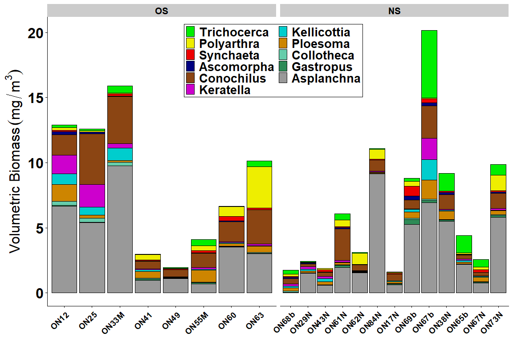

This Figure 2 shows a comparsion between rotifer assemblages in the eight offshore and thirteen nearshore stations collected in Lake Ontario during August 2023. The three western offshore stations exhibited higher biomass values compared with the eastern portion of the lake, and the differences are primaritly attributed to higher *Asplanchna* and *Conochilus* contributions. Additionally, the biomass of *Keratella*, *Kellicottia*, and *Collotheca* are notably higher in the western stations, likely associated with lower TP concentrations promoting taxa associated with more oligotrophic-like conditions (Barbiero and Warren, 2011; Marshall et al., 2024). Another notable difference is higher *Polyarthra* biomass in the five eastern stations, with the highest values at the easternmost station, indicating higher TP values and/or decreased predation pressures by *Cercopagis pengoi.*

For the nearshore stations, the six northern stations generally have less overall rotifer biomass when compared with the seven southern shore stations. The major biomass differences can be attributed first to the higher *Asplanchna* contributions in the south, and secondly to the overall rotifer community exhibiting higher contributions regardless of taxa. Unlike the trends seen in the offshore samples, the northern nearshore samples generally have a lower rotifer biomass in the west compared to the east portion of the lake. Conversely, the westernmost southern stations (apart from ON17N) exhibited higher rotifer biomass which was similar to the offshore trends. South shore samples have higher *Trichocerca* biomass likely impacted by elevated nutrient conditions given their proximity to streams and bays. Especially high contributions of *Trichocerca* were observed at ON67b, perhaps impacted by discharge from Eighteen Mile Creek near Olcott, NY.

[References:]{.underline}

## Rotifer Summer Genera Station Total Density Barplot

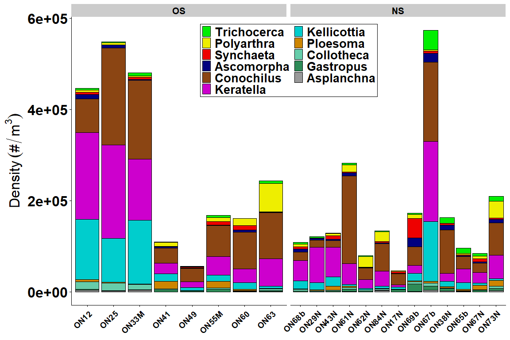

## Rotifer Spring Genera Station Total Biomass Barplot

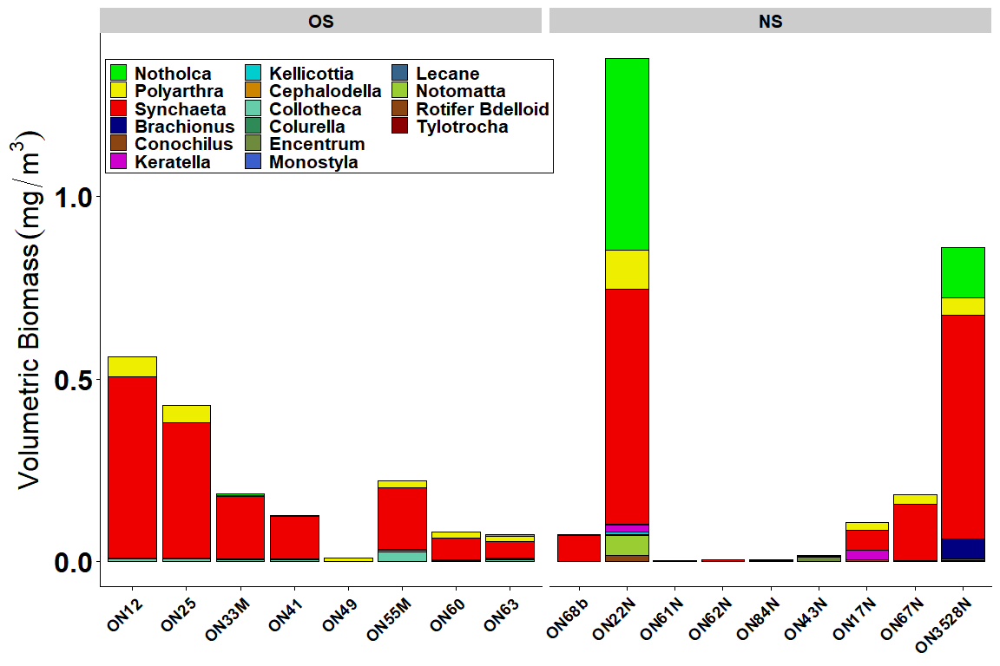

## Rotifer Spring Genera Station Total Density Barplot

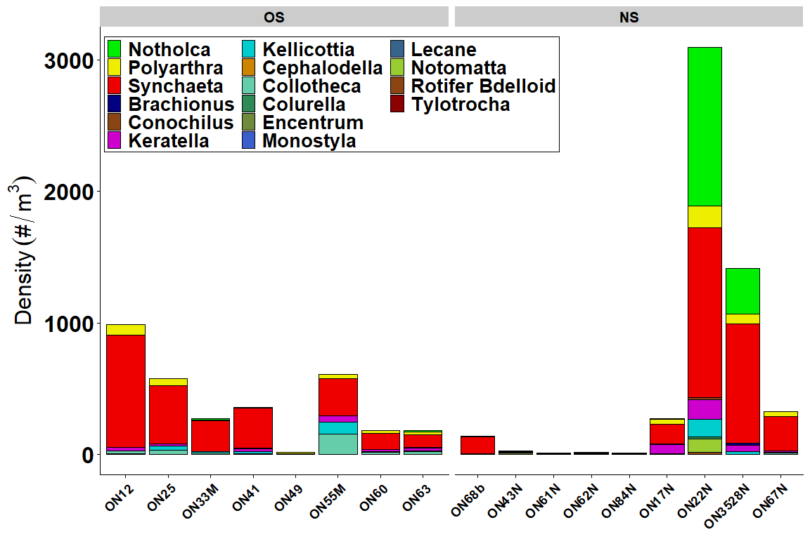

## Zoop Taxa Summer Offshore-Nearshore Biomass Barplot

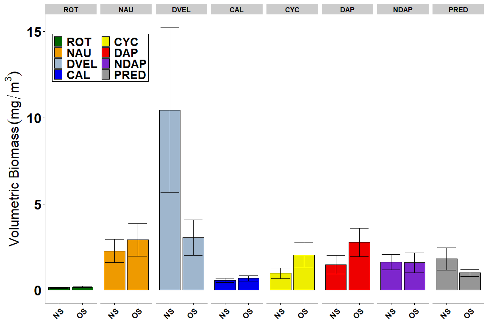

## Zoop Taxa Spring Offshore-Nearshore Biomass Barplot

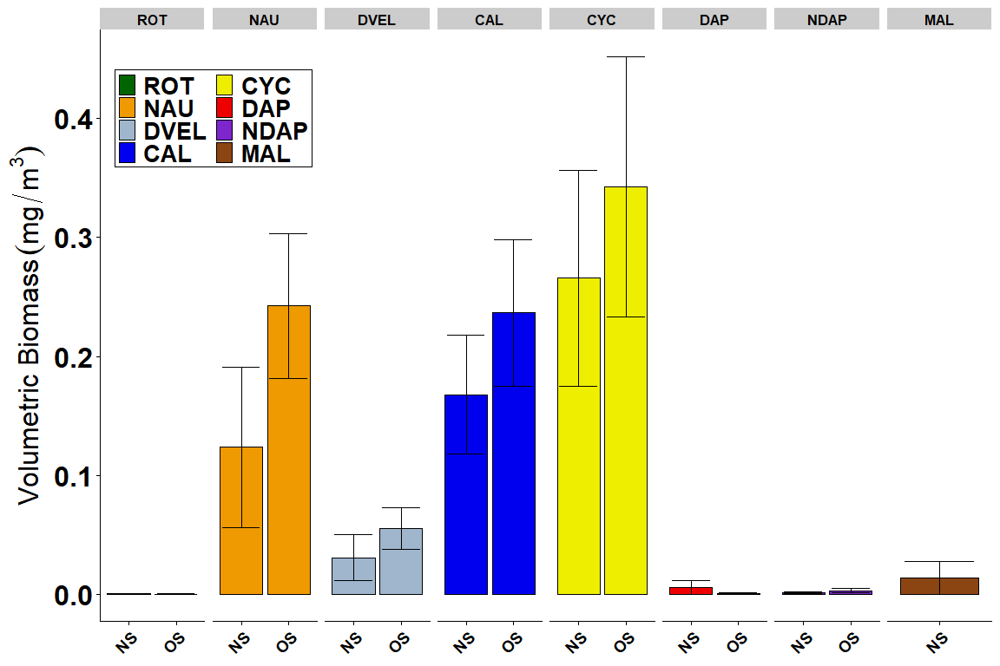

## Zoop Summer Taxa Station Total Biomass Barplot

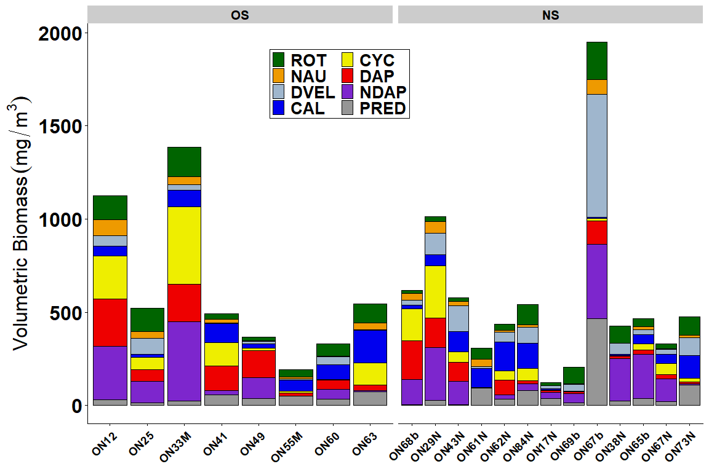

## Zoop Spring Taxa Station Total Biomass Barplot

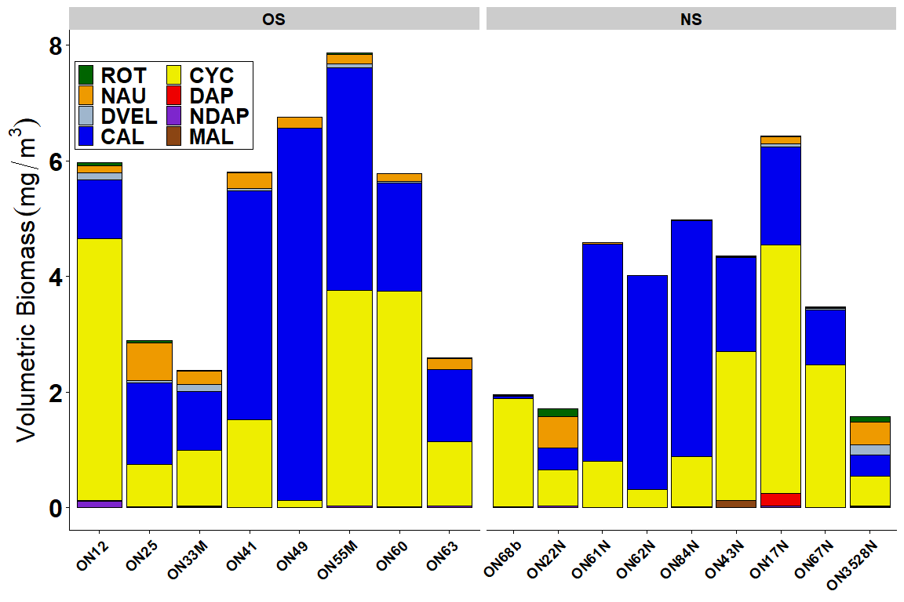

